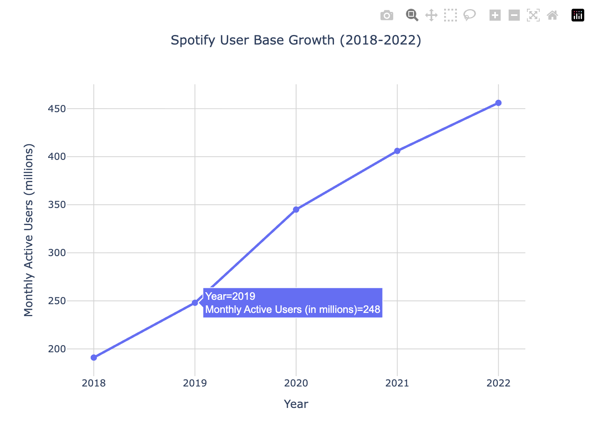
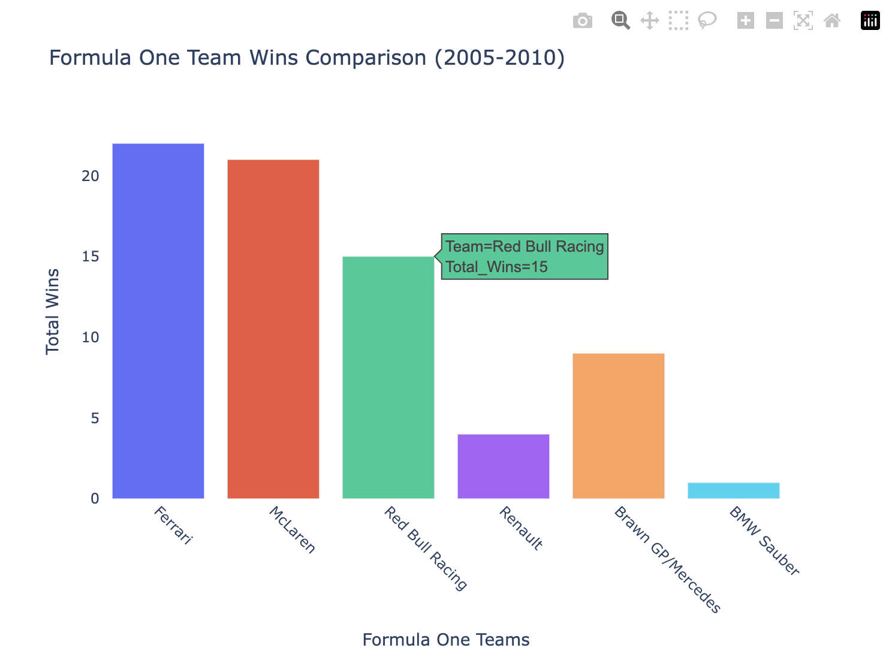

# Pecca Python SDK — Examples

Code examples for the [pecca-python](https://pypi.org/project/pecca-python/) SDK. Query your data, manage your knowledge base, and build AI-powered apps — all in Python.

---

## Installation

```bash
pip install pecca-python
```

---

## Getting Your API Key

1. Sign up at [pecca-ai.in](https://pecca-ai.in)
2. Go to your Dashboard and create an API key
3. Your key will look like `pecca_xxxxxxxxxxxxxx`

---

## Quick Start

```python
from pecca import Pecca

client = Pecca(api_key="pecca_xxxxxxxxxxxxxx")
response = client.ask_pecca(user_query="Who won the FIFA World Cup in 2018?")
print(response["response_text"])
```

---

## Example Charts

Pecca automatically generates interactive charts from your data. Here are two examples:





---

## API Reference

### `ask_pecca(user_query, use_only_knowledge_base=False, generate_graph=False)`

Ask a question. Pecca searches your knowledge base and its general knowledge to return an answer.

| Parameter | Type | Default | Description |
|-----------|------|---------|-------------|
| `user_query` | `str` | required | The question to ask |
| `use_only_knowledge_base` | `bool` | `False` | If `True`, only searches your uploaded files — ignores general knowledge |
| `generate_graph` | `bool` | `False` | If `True`, generates an interactive chart alongside the answer |

**Returns:** `dict` with `response_text` (str) and, when `generate_graph=True`, an `inference_id` (str).

```python
# General question
response = client.ask_pecca(user_query="Who won the FIFA World Cup in 2018?")
print(response["response_text"])

# Query only your uploaded data
response = client.ask_pecca(
    user_query="What was our total revenue in Q3?",
    use_only_knowledge_base=True,
)
print(response["response_text"])
```

---

### `upload_to_knowledge_base(file_path)`

Upload a file to your knowledge base. Supported types: **PDF, DOCX, TXT, CSV, XLSX, Parquet**.

| Parameter | Type | Description |
|-----------|------|-------------|
| `file_path` | `str` | Path to the file on your local machine |

**Returns:** `dict` with upload status.

```python
client.upload_to_knowledge_base("sales_data.xlsx")
```

---

### `view_knowledge_base()`

List all files currently in your knowledge base.

**Returns:** `dict` with a `files` list, where each item contains `filename` and metadata.

```python
response = client.view_knowledge_base()
for file in response["files"]:
    print(file["filename"])
```

---

### `download_from_knowledge_base(file_name, output_path)`

Download a file from your knowledge base to your local machine.

| Parameter | Type | Description |
|-----------|------|-------------|
| `file_name` | `str` | Name of the file in the knowledge base |
| `output_path` | `str` | Local path where the file will be saved |

**Returns:** `dict` with `status` and `message`.

```python
client.download_from_knowledge_base(
    file_name="sales_data.xlsx",
    output_path="downloads/sales_data.xlsx",
)
```

---

### `delete_from_knowledge_base(file_name)`

Remove a file from your knowledge base.

| Parameter | Type | Description |
|-----------|------|-------------|
| `file_name` | `str` | Name of the file to delete |

**Returns:** `dict` with deletion status.

```python
client.delete_from_knowledge_base(file_name="sales_data.xlsx")
```

---

### `download_chart(inference_id)`

Download an interactive chart generated by a previous `ask_pecca` call with `generate_graph=True`.

| Parameter | Type | Description |
|-----------|------|-------------|
| `inference_id` | `str` | The `inference_id` from the `ask_pecca` response |

**Returns:** `str` — an HTML string containing the interactive Plotly chart. Paste it into a `.html` file and open in a browser, or render it directly in your app.

```python
response = client.ask_pecca(
    user_query="Total number of males and females ever been in space from NASA",
    generate_graph=True,
)
inference_id = response["inference_id"]
chart_html = client.download_chart(inference_id=inference_id)

# Save and open in browser
with open("chart.html", "w") as f:
    f.write(chart_html)
```

---

## Build a RAG App with Streamlit

Build a chatbot over your own documents in minutes.

**Install dependencies:**

```bash
pip install pecca-python streamlit
```

**`app.py`:**

```python
import streamlit as st
from pecca import Pecca

client = Pecca(api_key="pecca_YOUR_API_KEY_HERE")

st.title("My RAG Chatbot")

uploaded_file = st.file_uploader("Upload a file")
if uploaded_file:
    with open(uploaded_file.name, "wb") as f:
        f.write(uploaded_file.getbuffer())
    client.upload_to_knowledge_base(file_path=uploaded_file.name)
    st.success("File uploaded!")

if "messages" not in st.session_state:
    st.session_state.messages = []

for message in st.session_state.messages:
    with st.chat_message(message["role"]):
        st.write(message["content"])

query = st.chat_input("Ask a question about your data")
if query:
    st.session_state.messages.append({"role": "user", "content": query})
    with st.chat_message("user"):
        st.write(query)
    with st.spinner("Thinking..."):
        response = client.ask_pecca(user_query=query, use_only_knowledge_base=False)
        answer = response["response_text"]
    st.session_state.messages.append({"role": "assistant", "content": answer})
    with st.chat_message("assistant"):
        st.write(answer)
```

**Run it:**

```bash
streamlit run app.py
```

---

## Supported File Types

| Type | Format |
|------|--------|
| Documents | PDF, DOCX, TXT |
| Spreadsheets | CSV, XLSX, Parquet |

---

## Links

- [pecca-ai.in](https://pecca-ai.in)
- [PyPI: pecca-python](https://pypi.org/project/pecca-python/)
